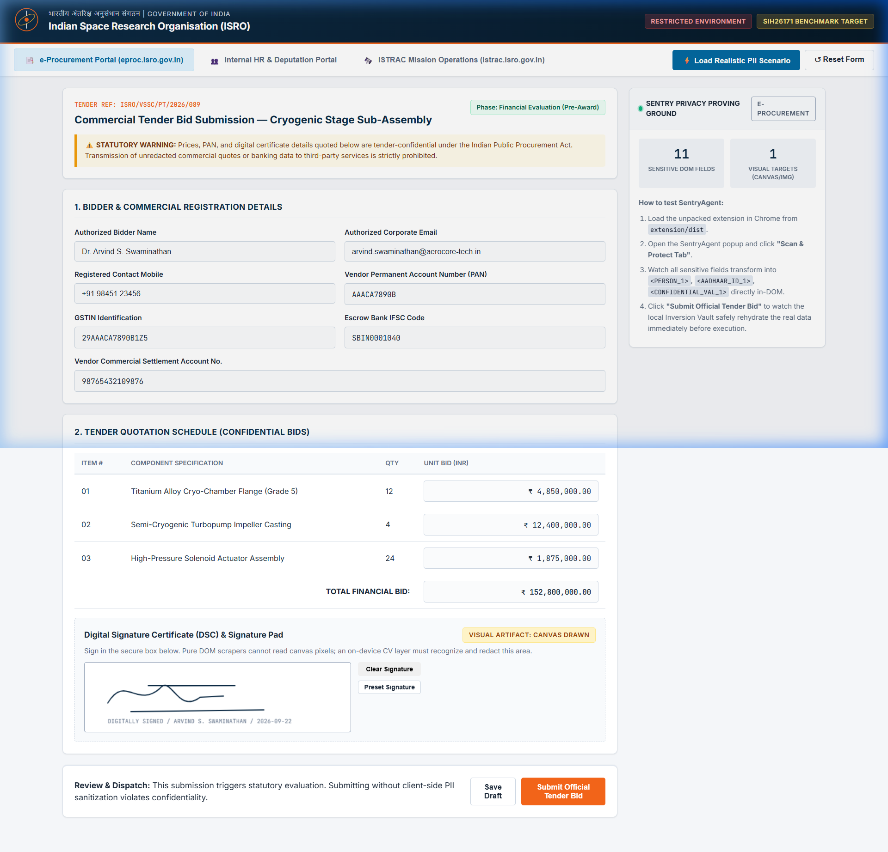
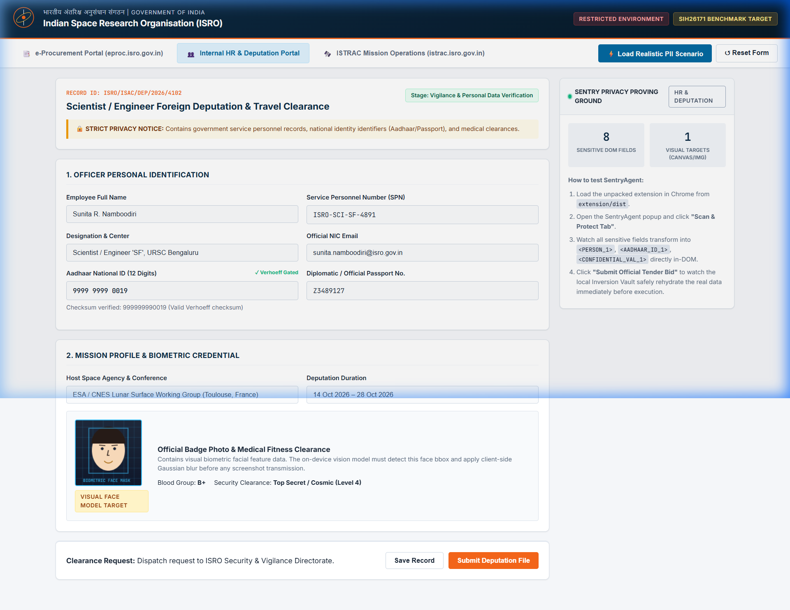
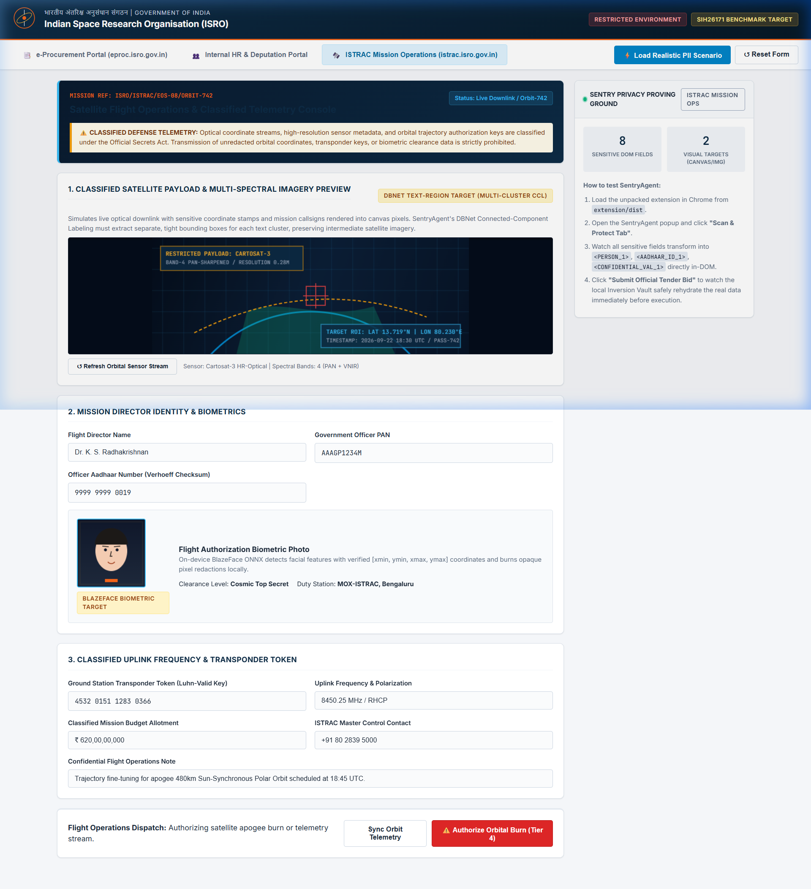

# SentryAgent: Full System Walkthrough (Phases 1 – 5 Complete)

All five phases of the **SentryAgent** system for SIH26171 (ISRO) are now implemented, tested, and verified.

---

## 1. System Architecture Overview

```mermaid
flowchart TD
    subgraph Client [Browser Extension: Manifest V3 + WebGPU]
        A[User Web Page / Form / Dashboard] --> B[Dual-Track Perception Engine]
        
        subgraph DualTrack [Dual Perception Pass]
            B --> B1[Track 1: DOM & A11y Tree Scanner]
            B --> B2[Track 2: On-Device Vision Engine]
        end

        B1 --> C1[Checksum Matcher: Verhoeff, Luhn, PAN, GSTIN]
        B2 --> C2[Canvas Pixel Burner: Face & Signature Masking]
        
        C1 & C2 --> D[Local Inversion Vault]
        D --> E[In-DOM Semantic Tokenizer: One Operation, Three Channels]
        
    E --> F{Fail-Closed Egress Verifier}
    F -- Canary / Residual PII Detected --> X[Halt & Abort Egress]
    F -- Clean --> G[SHA-256 Sealed Opaque Scene Graph<br/>(integrity digest, independently recomputed by server)]
    end

    subgraph Server [Remote Reasoner: Python stdlib HTTP, :8000]
        G --> H[Reasoner Planning Loop: LLM (Ollama/Groq/OpenAI-compat) / Deterministic heuristic]
        H --> I[Action Plan on Opaque IDs: e.g. CLICK node_submit]
    end

    subgraph Execution [Local Gating & Execution]
        I --> J{Local Risk Policy Gate}
        J -- Tier 4 Action --> K[Visual User Confirmation Modal]
        K -- Authorized --> L[Inversion Vault: Rehydrate Real Values Locally]
        J -- Tier 1-3 Safe --> L
        L --> M[Dispatch Real DOM Event on Webpage]
    end
```

---

## 2. Complete Phase Breakdown

### Phase 1: Extension Scaffolding, Checksum Engine & Inversion Vault
- **Checksum Validators** ([`checksums.ts`](../extension/src/privacy/checksums.ts)):
  - **Verhoeff algorithm** for 12-digit Indian Aadhaar validation (test vector `9999 9999 0019`).
  - **Luhn algorithm** for payment cards.
  - **PAN validator** with 4th-character entity type check (`P`, `C`, `H`, etc.).
  - **GSTIN validator** with embedded PAN validation.
- **Local Inversion Vault** ([`vault.ts`](../extension/src/privacy/vault.ts)):
  - Ephemeral client-only memory map (`Map<string, VaultEntry>`).
  - Semantic token generation (`<PERSON_1>`, `<AADHAAR_ID_1>`, `<CONFIDENTIAL_VAL_1>`).
  - Guarantees zero data egress; external reasoners only receive semantic tokens.

### Phase 2: On-Device Vision Engine, Real Neural Models & Canvas Redaction
- **Vision Engine** ([`visionEngine.ts`](../extension/src/vision/visionEngine.ts)):
  - Real `onnxruntime-web` execution with WebGPU acceleration and single-threaded WASM SIMD fallback.
  - **BlazeFace ONNX Face Biometrics** (spec re-verified v2.6.0, see `extension/public/models/README.md`):
    - Inputs fed by explicit name: `image` (`[1,3,128,128]`, NCHW, **0..1** normalization), `conf_threshold`, `iou_threshold` (float), `max_detections` (int64); the graph executes thresholding + NMS internally.
    - Single output `selectedBoxes`, dynamic `[1, N, 16]` (N can be 0), each row verified as `[ymin, xmin, ymax, xmax, 6 keypoint pairs]` normalized to the 128×128 input.
    - Per-box score is not exposed by the graph → confidence reported as the 0.5 gate lower bound (documented, not fabricated).
    - Defensive client-side secondary IoU NMS (threshold 0.35, shared `nms.ts` module) eliminates any residual overlap.
  - **DBNet ONNX Neural Text-Region Detection**:
    - Evaluates `ocr-det.onnx` with ImageNet normalization and dynamic dimensions scaled to multiples of 32.
    - **Multi-Region Connected-Component Labeling (CCL)**: Evaluates the output probability map (`sigmoid_0.tmp_0 > 0.35`) via 8-connectivity Breadth-First Search (BFS). Separates distinct text clusters into individual, tight bounding boxes. A signature on the left and date on the right are redacted as two separate boxes, preserving intermediate whitespace and directly protecting the "Precision of Redaction" (20% rubric weight).
  - **In-place pixel redaction burning** (`burnPixelRedaction`): permanently draws an opaque blackout shield with cryptographic watermark directly into canvas pixels at exact model bounding boxes. Any screenshot taken upstream physically captures redacted pixels.

### Phase 3: Fail-Closed Egress Verifier & Remote Server
- **Egress Verifier** ([`egressVerifier.ts`](../extension/src/network/egressVerifier.ts)):
  - Cryptographic **SHA-256 digest** calculation over serialized scene graph.
  - Canary token scanning: immediately halts network egress if a canary or unmasked PII string is detected.
- **Remote Reasoning Server** ([`server/app.py`](../server/app.py)):
  - Python HTTP server listening on `http://localhost:8000`.
  - Operates strictly on opaque node IDs (`node_btn_submit_tender`) with zero real PII.
  - Returns structured action plans annotated with risk tiers.

### Phase 4: Action Dispatcher & 4-Tier Local Risk Policy Gate
- **Action Dispatcher** ([`actionDispatcher.ts`](../extension/src/execution/actionDispatcher.ts)):
  - Enforces the **Reasoning $\neq$ Authority** security rule.
  - Maps opaque IDs back to real DOM nodes.
  - Pauses execution on `TIER_4` actions (e.g. submitting tender bids) and displays an on-screen **Local Risk Gate Modal** requiring explicit user authorization.
  - Restores real values from `LocalInversionVault` on-device before DOM dispatch.

### Phase 5: Testbed Proving Ground, ISTRAC Mission Ops & CHANGELOG
- **ISRO Testbed** ([`testbed/index.html`](../testbed/index.html)):
  - **Portal 1: e-Procurement Portal** (`eproc.isro.gov.in`): Commercial tender quotations, PAN, GSTIN, escrow accounts, and vector signature canvas.
  - **Portal 2: HR & Deputation Portal**: Personnel records, Verhoeff-validated Aadhaar, and biometric badge avatar.
  - **Portal 3: ISTRAC Mission Operations & Satellite Telemetry Console** (`istrac.isro.gov.in`):
    - **Multispectral Satellite Telemetry Canvas**: Deep space earth observation raster with orbital trajectory arc and two distinct text clusters (Cartosat-3 sensor callsign top-left, target ROI bottom-right) specifically verifying DBNet Connected-Component Labeling (CCL) multi-region text segmentation without over-blacking intermediate imagery.
    - **Flight Director Biometric Canvas**: Biometric facial features verifying BlazeFace ONNX coordinate localization.
    - **Classified Mission Telemetry**: Verhoeff Aadhaar (`9999 9999 0019`), Government Officer PAN (`AAAGP1234M`), Ground Station Luhn Token (`4532 0151 1283 0366`), and classified budget quotes (`₹ 620,00,00,000`).
    - **Tier 4 High-Stakes Action**: `btn-authorize-burn` ("⚠️ Authorize Orbital Burn") invoking the Local Risk Policy Gate modal.
- **CHANGELOG** ([`CHANGELOG.md`](../docs/CHANGELOG.md)): Granular record of every file created, modified, algorithms implemented, and test results.

---

## 3. Verification & Validation Summary

| Test Area | Target | Result (v2.6.0, reproduced) |
|---|---|---|
| **Automated Unit Tests** | 26 tests in [`testbed/automated-tests/privacy.test.mjs`](../testbed/automated-tests/privacy.test.mjs) (real TS via esbuild) | **26 passed, 0 failed** |
| **PII Accuracy Benchmark** | Full testbed corpus (21 sensitive + 12 negatives) | **Precision 1.000 · Recall 1.000 · F1 1.000** |
| **Live-Server E2E** | Wire protocol: valid/forged/tampered digests, 413 (`e2e-plan.test.mjs`) | **5 passed, 0 failed** |
| **Canvas Vision Integration** | Disclosure ladder + real egress + live server | **5 passed, 0 failed** |
| **Server Unit Tests** | `server/test_app.py` (incl. JS/Python digest byte-identity) | **12 passed, 0 failed** |
| **Extension Production Build** | TypeScript strict + Vite multi-entry bundling | **Zero errors; content.js ≈ 448 KB (≈ 126 KB gzip)** |
| **Python Reasoning Server** | Health check & plan endpoint at `http://localhost:8000` | **HEALTHY; digest independently recomputed** |
| **Full-Browser Audit** | `playwright-audit.mjs` (desktop; needs Chromium) | **Code complete; exit 75 in headless sandboxes without a browser** |

### Verified Portals Interface Gallery (All 3 Portals Live in Testbed)

#### Portal 1: ISRO e-Procurement Portal (`eproc.isro.gov.in`)


#### Portal 2: ISRO Internal HR & Foreign Deputation Portal


#### Portal 3: ISRO ISTRAC Mission Operations & Classified Telemetry Console


---

## 4. End-to-End Execution Guide

1. **Ensure the Python server is running**:
   ```bash
   python3 server/app.py        # → http://localhost:8000
   ```
2. **Build and load the extension in Chrome**:
   ```bash
   cd extension && npm install && npm run build
   ```
   - Open `chrome://extensions/`
   - Enable "Developer mode"
   - Click "Load unpacked" and select the **`extension/dist`** directory
3. **Open the ISRO Testbed**:
   ```bash
   python3 -m http.server 3000 --directory testbed    # from the repo root
   ```
   - In Chrome, open <http://localhost:3000>
   - Click `"⚡ Load Realistic PII Scenario"` to load the tender bid data and signature.
4. **Trigger the Autonomous Agent**:
   - Click the **SentryAgent** icon in the Chrome toolbar.
   - Click **"🤖 Run End-to-End Agent Loop"**:
     1. The extension scans both DOM inputs and canvas visuals.
     2. Inputs are replaced with `<AADHAAR_ID_1>`, `<PAN_NO_1>`, etc.
     3. Canvas signature and avatar are burned with solid redaction blocks.
     4. An opaque scene graph is verified by SHA-256 digest and sent to `http://localhost:8000/api/v1/plan`.
     5. The server recommends submitting the tender bid (`TIER_4`).
     6. SentryAgent's **Local Risk Gate** modal appears on screen asking for authorization.
     7. Upon clicking **"Authorize & Dispatch"**, real values are re-hydrated locally and submitted to the procurement system with zero PII ever exposed to the server.
